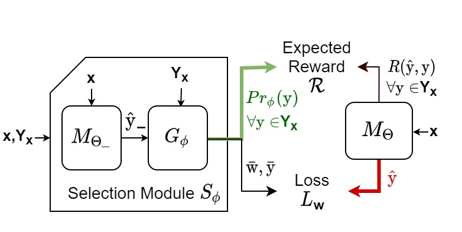

# One-of-Many Learning

Training and data generation codes for [Learning One-of-Many Solutions for Combinatorial Problems in Structured Output Spaces](https://openreview.net/forum?id=ATp1nW2FuZL).

<p align="center">
  
  <br>
    <em>SelectR model for handling solution multiplicity.</em>
</p>

## Prerequisites
* Python 3
* PyTorch >= 0.4.0
* Other required python packages specified by `requirements.txt`. See the Installation.

## Installation

Clone this repository:

```
git clone https://github.com/dair-iitd/1oML --recursive
```

Install [Jacinle](https://github.com/vacancy/Jacinle) included in `third_party/Jacinle`. You need to add the bin path to your global `PATH` environment variable:

```
export PATH=<path_to_1oML>/third_party/Jacinle/bin:$PATH
```

Create a conda environment for 1oML, and install the requirements. This includes the required python packages
from both Jacinle and NLM. Most of the required packages have been included in the built-in `anaconda` package:

```
conda create -n nlm anaconda
conda install pytorch torchvision -c pytorch
```


Install [dgl](https://github.com/dmlc/dgl) for RRN. 


## Data Generation
This repo contains three tasks over which we experiment in 1oML setting - NQueens, Futoshiki and Sudoku. 
To generate data for training and evaluating the models follow the instruction below.

* NQueens
```
python nqueens_datagen.py --ofile [output pkl file] --board-size 10 --num-missing 5 --sample
```

* Futoshiki
```
python futoshiki_datagen.py --ofile [output pkl file] --num-samples 10000 --nthreads 4 --board-size 5 --num-missing 10 --num-constraints 5 --mode [train/test/val]
```

* Sudoku
```
# Compile Jsolve for solving Sudoku puzzles.
cd Jsolve
make

# Create multiple-solution and unique-solution pickle files.
python sudoku_datagen.py --ambfile [multi-solution output path] --unqfile [unique-solution output path] --ifile [input file containing unique-solution sudoku puzzles] --jsolve Jsolve/jsolve 

# Sample queries from multi-solution and unique-solution pickle files to have uniform distribution of givens.

python data_sampling_sudoku.py --ifile [multi-solution pkl path] --ufile [unique-solution pkl path] --ofile [output path] --num_samples 5000
```

## Training and evaluating models
```
jac-run scripts/graph/exploration.py --task nqueens --nlm-residual 1 --use-gpu --latent-residual 1 --test-interval 1 --save-interval 20 \
 --epochs 100 --warmup-epochs 100 --train-number 10 --num-missing-queens 5 --nlm-depth 30 --test-number-begin 11 --test-number-end 11 \
 --seed 1729 --lr-hot 0.0005 --wt-decay 0.0001 --constraints-wt 0.01 --min-loss 1 --warmup-data-sampling three-one\
 --dump-dir [path to output folder] --train-file [path to train file] --test-file [path to validation file]
```
To evaluate the model on test file give test file path instead of validation file and add flag `--test-only`.

Check out further command line arguments and their description by running
```
jac-run scripts/graph/exploration.py --help
```

## Acknowledgements
A lot of our trainer source code is inspired from [google/neural-logic-machines](https://github.com/google/neural-logic-machines).
